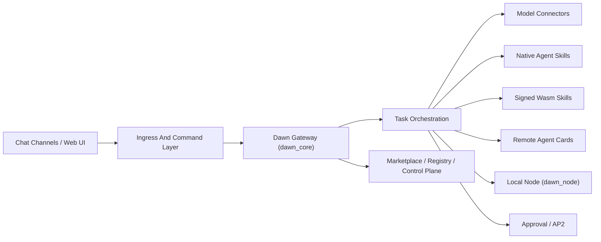

# DawnSys A2A Application

一个面向本地节点、Agent 编排、多模型接入、多聊天通道接入和人机协同审批的 Dawn 运行时系统。

当前仓库的真实运行主线是 `dawn_core + dawn_node`。它不是旧版 Django / Vue 工程的包装层，而是一套以 Rust 为核心的本地优先自动化执行系统。

## DawnSys 是什么

DawnSys 要解决的不是单点的模型调用问题，而是把一整条自动化链路收敛到同一个运行时里：

- 从聊天入口、Web 工作台或控制台接收任务
- 把任务转换成可执行的 A2A / 本地工作流
- 根据任务类型路由到云模型、本地模型、原生技能、Wasm 技能或远程 Agent
- 在关键步骤上插入审批、授权、支付或人工确认
- 把结果回写到聊天通道、工作台、控制台和可审计事件流

换句话说，DawnSys 更像一个本地优先的 Agent Automation Runtime，而不只是一个模型网关。

## 系统优势

- 统一运行时
  聊天接入、任务编排、模型连接器、技能系统、Agent Card、审批和 Marketplace 在同一套状态与控制平面里运行，不需要把链路拆散到多套系统。
- 本地优先
  `dawn_node` 可以直接驻留在本机，承接桌面环境、工作区文件、节点状态和本地模型，让自动化真正落到本地执行，而不是只停留在云端推理。
- 云端与本地模型同构
  系统把 OpenAI、Anthropic、Google、DeepSeek、Qwen、Zhipu、Moonshot、Doubao、Ollama 等统一到一个连接器层；Gemma4 这类本地模型也能直接进入同一条编排链路。
- 原生 Agent 能力可组合
  Dawn 不只支持安装 Wasm 技能，也支持原生内置 skills，把系统级能力直接做成可见、可调用、可运营的 Agent 技能。
- 人在环治理
  对高风险动作、授权链路和 AP2 支付场景，可以在流程中插入审批、签名和确认，而不是把所有动作都交给自动化盲执行。
- 可审计进化
  系统可以把真实任务、聊天入口、执行结果和复盘经验沉淀到本地经验库中，供后续规划和技能提案检索；经验写入不等于自动改代码或自动发布。
  网关启动后会运行低风险自动复盘 worker，默认只从最近聊天事件生成经验记录。它不会调用模型自评、不会执行动作、不会激活技能；如需关闭可设置 `DAWN_EVOLUTION_AUTO_REFLECTION=0`。
  当经验库中出现重复的非普通聊天任务模式时，Evolution API 可以生成候选 skill proposal。proposal 只是一条待评审建议，不会创建代码、不注册 skill、不改变权限。
  操作员可以把 proposal 标记为 `approved`、`rejected` 或 `deferred`。这些状态只用于审计和后续人工实现排队，批准 proposal 仍不会自动激活 skill。
  对已批准 proposal，系统可以生成 draft implementation plan，用来记录实现步骤、验收条件和安全边界；plan 可以继续被标记为 `approved`、`rejected` 或 `deferred`，但仍然不会自动修改代码、执行实现或发布能力。
  对已批准 plan，系统可以准备 implementation run/change package，记录允许变更范围、验证命令和回滚说明；run 的 review 也只表示允许进入后续人工或未来 agent 执行阶段，不会在当前 API 中实际执行变更。
  对已批准 run，系统可以创建 implementation execution 记录，保存 preflight、命令计划、执行边界和人工审批结果；被再次批准后，网关只允许通过 `/verify` 执行固定 allowlist 里的验证命令并采集证据，不允许任意 shell、代码变更、技能激活或发布版本。
  对已通过验证的 execution，系统可以创建 patch candidate，记录候选变更文件、补丁 manifest、回滚计划和验证证据；candidate 被批准后可以通过独立的 `/apply` 和 `/rollback` API 进行受控 dry-run、应用和回滚。真实写文件或真实回滚必须带 `confirmPatchId`，并且只允许 manifest 中明确列出的非 QGIS 文本文件路径；`.git`、`data`、`target`、缓存、输出目录和密钥类路径会被拒绝。应用后仍不会自动激活 skill 或发布版本，必须继续走验证与发布审批。
- 双视角界面
  `/app` 面向终端用户和任务工作台，`/console` 面向操作员与治理层。系统不是单 UI，而是同时服务执行层和运营层。
- 可扩展分发
  Agent Card、Marketplace、签名技能分发和联邦目录已经在运行时内建，意味着这套系统天然支持跨节点、跨网关的能力流转。

## 运行架构



### 关键组件

- `dawn_core/`
  Rust 网关主进程，负责 A2A、任务编排、连接器、控制平面、Marketplace、Agent Card、审批与技能注册。
- `dawn_node/`
  本地节点运行时，负责把 Dawn 拉到桌面环境与本机工作区执行。
- `workflow/native_skills/`
  系统原生内置 skills。它们不是 Wasm 包，而是随 Dawn 运行时直接交付的本机能力。
- `docs/`
  架构说明、协议说明、Gemma4 接入说明等专题文档。

## 内置 Agent Skills

当前系统内置的 Dawn 原生 skills 会直接出现在技能分发、`/skills` 查询和 Marketplace 中，不需要额外安装：

- `agent-card-discoverer`
  负责 A2A Agent Card 的发现、筛选、导入与联邦目录运营。
- `bayesian-skill-set`
  负责不确定场景下的观察、辅助、分级决策与下一步建议。
- `dawn-orchestrator`
  负责把自然语言需求转成任务、子任务、委托链路和执行编排。
- `dawn-chat-bridge`
  负责多聊天平台命令归一化、消息入站和结果回写。
- `dawn-desktop-control`
  负责把手机端聊天意图安全桥接到屏幕观察、鼠标位置、鼠标移动和点击控制。
- `dawn-model-router`
  负责模型选择、连接器路由、本地模型接入和调用落点控制。
- `dawn-node-operator`
  负责本地节点运行、健康检查、工作区执行与 rollout 操作。
- `dawn-approval-guard`
  负责审批、授权、敏感动作门禁与 AP2 人在环治理。
- `dawn-marketplace-operator`
  负责技能与 Agent 的发布、搜索、安装、联邦同步和市场运营。

这些内置 skills 的意义在于：系统级能力不再只是散落在 CLI 命令和后台接口里，而是被提升为可发现、可说明、可运营的 Agent 能力层。

## 核心能力

- A2A 任务接入、委托与执行
- 本地节点注册、心跳、命令下发与结果回传
- 多模型连接器统一调用
- 多聊天平台入站事件接收与出站分发
- Agent Card 发布、导入、发现与远程调用
- 原生 skills 与签名 Wasm 技能分发
- Marketplace 与联邦目录聚合
- Approval Center、Control Center 和终端用户工作台
- AP2 支付授权与人工确认链路
- Evolution experience store，用于低风险经验沉淀和后续技能提案
- 本地 Ollama 模型接入，包括 Gemma4

## 典型适用场景

- 把本地部署的 Gemma4 接入到统一自动化系统，承接工作区任务和桌面节点执行
- 从 Telegram、Slack、Discord、飞书等入口统一收任务，再分发到模型、技能或远程 Agent
- 搭建一个有审批门禁的本地 Agent 工作台，而不是纯聊天机器人
- 发布自己的 Agent Card 和技能目录，让其他 Dawn 节点可发现、可接入
- 在本机保留数据和执行控制权，同时继续使用云模型补充能力

## 快速启动

### 依赖

- Windows + PowerShell
- 普通用户使用 Windows Release 包时不需要 Rust、Cargo、Visual Studio Build Tools 或 `link.exe`
- 开发者从源码运行或测试时才需要 Rust stable、Cargo，以及 Windows MSVC 构建工具链

### 直接启动 Dawn

在仓库根目录执行：

```powershell
.\dawn.ps1
```

这条命令会走 `dawn-node start --app` 路径，自动拉起网关、节点预检查并打开工作台。

发布包应该内置预编译的 `dawn_node.exe` 和 `dawn_core.exe`。如果从源码仓库运行且没有预编译二进制，`dawn.ps1` 默认不会自动调用 `cargo run`，以免普通用户遇到 MSVC `link.exe` 缺失问题。开发者可以显式使用：

```powershell
.\dawn.ps1 --dev start --app
```

如果需要在本机从源码运行测试，先加载工作区内的 MSVC Build Tools 环境：

```powershell
.\Use-DawnBuildTools.ps1
cargo test --manifest-path dawn_node/Cargo.toml
```

默认入口：

- 终端用户工作台: [http://127.0.0.1:8000/app](http://127.0.0.1:8000/app)
- 操作员控制台: [http://127.0.0.1:8000/console](http://127.0.0.1:8000/console)
- 健康检查: [http://127.0.0.1:8000/health](http://127.0.0.1:8000/health)
- Agent Card: [http://127.0.0.1:8000/.well-known/agent-card.json](http://127.0.0.1:8000/.well-known/agent-card.json)

### 常用命令

```powershell
.\dawn.ps1 status
.\dawn.ps1 connectors status
.\dawn.ps1 gateway start
.\dawn.ps1 models test ollama --input "Respond with exactly: OK"
```

## 本地 Gemma4 接入

你当前这套仓库已经支持通过现有 `ollama` connector 直接使用本地 Gemma4。

### 一键接入

```powershell
.\Start-DawnGemma4.ps1
```

这个脚本会：

- 持久化 `OLLAMA_BASE_URL`
- 持久化 `OLLAMA_DEFAULT_MODEL=gemma4-e2b-local`
- 启动 `D:\Gemma 4\start-ollama.ps1`
- 启动 Dawn 并打开 `/app`

### 手动接入

```powershell
.\dawn.ps1 secrets set OLLAMA_BASE_URL http://127.0.0.1:11434
.\dawn.ps1 secrets set OLLAMA_DEFAULT_MODEL gemma4-e2b-local
.\dawn.ps1 models add ollama
```

测试链路：

```powershell
.\dawn.ps1 models test ollama --input "Respond with exactly: GEMMA4_OK"
```

## 工作流中的模型接入方式

在编排步骤里继续使用现有 `model_connector`：

```json
{
  "kind": "model_connector",
  "provider": "ollama",
  "input": "Summarize {{task.name}}"
}
```

如果已经设置了 `OLLAMA_DEFAULT_MODEL`，系统会默认调用 `gemma4-e2b-local`。如果某个流程想强制指定模型，也可以在步骤里显式写 `model` 字段。

## 文档

- [Rust 网关实现说明](docs/dawn_rust_gateway_implementation.md)
- [Gemma4 本地接入说明](docs/gemma4_ollama_integration.md)
- [AP2 串口签名协议](docs/ap2_serial_signer_protocol.md)

## 许可证

本项目采用 [MIT License](LICENSE)。
